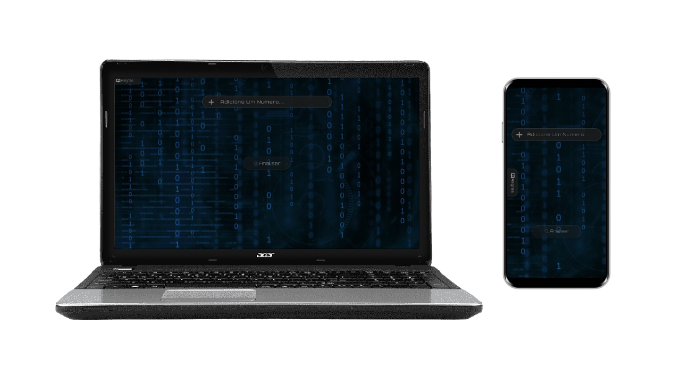
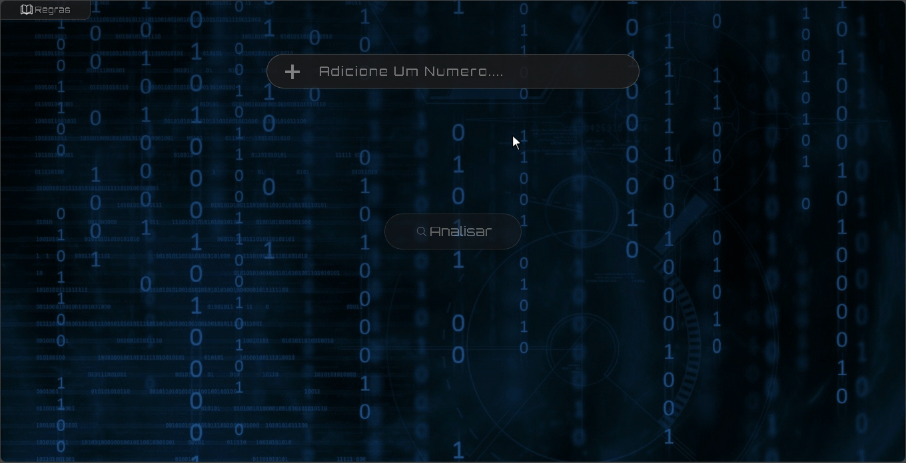

# 💻Analisar Numeros

## __🚀Iniciando__

Para instalar as dependencias digite: ```$ npm install```
<br/>
Para iniciar o projeto digite: ```$ npm start```
<br/>
Para rodar os testes digite: ```$ npm test```

## __💡Objetivo__
A premissa do projeto é a análise de números, com o objetivo de retornar informações relevantes. Essas informações incluem:

__1. Quantidade de Números Inseridos:__ Determinar quantos números foram fornecidos.

__2. Maior Número:__ Encontrar o maior número entre os valores inseridos.

__3. Menor Número:__ Identificar o menor número entre os valores inseridos.

__4. Soma dos Números:__ Calcular a soma total dos números fornecidos.

__5. Média dos Números:__ Calcular a média dos valores, dividindo a soma total pelo número de elementos.



## __🧰Ferramantas__
<div>
    
    
    
    
    
    
</div>
<br/>

## __🎥Previa__


## 📖Aprendizado

Ao atualizar este projeto, decidi aplicar vários conceitos e novas habilidades. Esses conceitos incluem:

__1. URL State:__ Isso envolve a adição de parâmetros à URL para permitir a restauração do estado de uma página ao utilizar a URL.

__2. Webpack e Babel:__ São bibliotecas que garantem a compatibilidade do código com os navegadores.

__3. Jest:__ É uma biblioteca para criar testes unitários, com o objetivo de verificar se o código está se comportando conforme o esperado.

Mesmo sendo um projeto simples, ele me proporcionou a oportunidade de praticar várias novas habilidades, que são essenciais para desenvolvimento web atualmente.